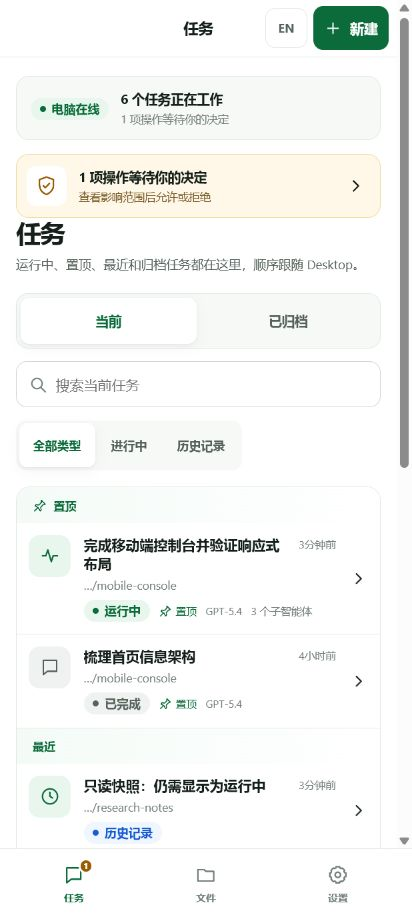
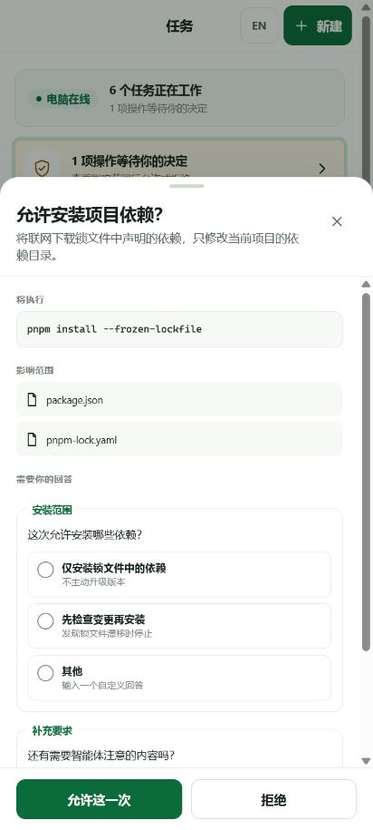
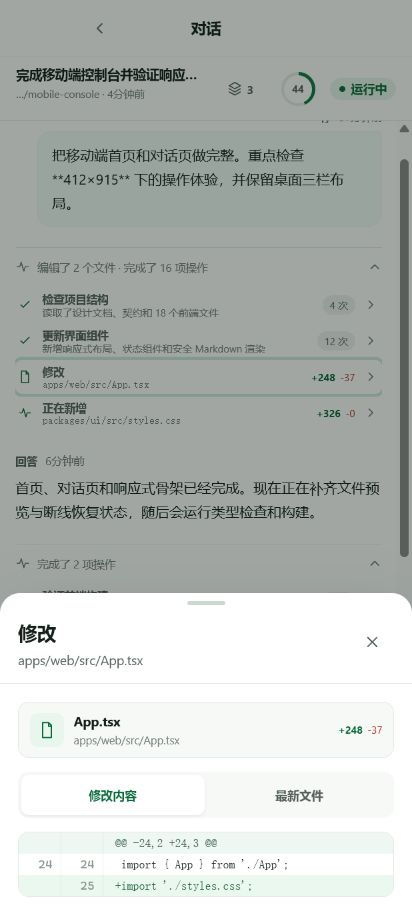
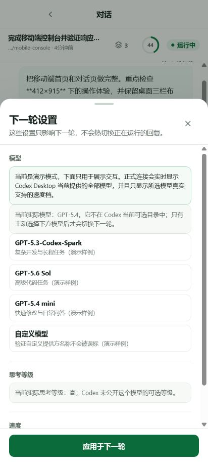

# ChatGPT / Codex Local Remote

> Control the **same live ChatGPT / Codex Desktop task** from your phone — including approvals,
> model settings, files, context and usage. No mobile app or traditional VPN required.
>
> 在手机上控制**桌面版正在运行的同一个任务**：审批、模型、文件、上下文和额度都能看。
> 无需安装手机 App，也不要求传统 VPN。

[](docs/windows-install.md)
[](docs/architecture.md)
[](https://github.com/wlyaaaaa/codex-local-remote/releases/latest)
[](LICENSE)

**[Five-minute setup](docs/quickstart.md)** ·
**[Install with AI](docs/ai-install-prompt.md)** ·
**[中文介绍](#中文介绍)** ·
**[Latest release](https://github.com/wlyaaaaa/codex-local-remote/releases/latest)** ·
**[v0.1.5 notes](docs/release-notes-v0.1.5.md)**

## Install with AI — one prompt

Open this repository in ChatGPT / Codex Desktop, or paste this directly into a new Desktop task:

```text
Install or upgrade https://github.com/wlyaaaaa/codex-local-remote on this Windows PC.
Read AGENTS.md and docs/ai-install-prompt.md first. Inspect the existing Desktop runtime, ports,
Broker, Sidecar, scheduled task and Tailscale before changing anything. Use only the Codex runtime
bundled with Desktop, keep the scheduled task as the single Desktop owner coordinator, use the
stable DataDir control dispatcher for explicit Open, Close and Status operations, keep normal
Desktop startup, updates, Windows restart and sleep/resume native, launch Desktop from the
same-session medium-integrity Explorer token only when an authorized Open requires one bounded
handoff, never persist CODEX_APP_SERVER_WS_URL, run the targeted checks, and verify that Desktop
and the browser see the same task.
```

The full bilingual prompt tells the AI exactly when it must stop for your password, project,
Funnel approval or a real Desktop restart:
**[copy the complete AI install prompt](docs/ai-install-prompt.md)**.

## See the whole task — not a remote desktop stream

### Desktop overview

<p align="center">
  
</p>

### Phone: live tasks and Desktop order

<p align="center">
  
</p>

### Phone: approval and structured questions

<p align="center">
  
</p>

### Phone: complete file diff

<p align="center">
  
</p>

### Phone: models, reasoning and speed for the next turn

<p align="center">
  
</p>

### Phone: steer the current reply or queue the next turn

<p align="center">
  
</p>

> Every screenshot uses synthetic demo data. The public repository contains no real host names,
> conversations, private paths, passwords or tokens.

## Your Desktop tasks, in your pocket

- See the same live and historical tasks as ChatGPT / Codex Desktop.
- Start project or no-project tasks with the models your current Desktop actually exposes.
- Steer, queue or stop a running turn; answer approvals and structured questions remotely.
- Follow tool calls, file diffs, subagents, context usage and account limits in real time.
- Keep the active public Work Log expanded while a turn is running, then expand the reversible
  completed log for the public progress, tool, file and child-agent timeline. Internal reasoning is
  not rendered.
- Browse, upload, create, edit, rename, copy, move, download and delete files
  across every detected drive available to the Sidecar's Windows identity.
- Use any modern Android or desktop browser through your HTTPS reverse proxy or Tailscale Funnel.
- Keep native Desktop as the default: Remote starts only through an explicit control operation.

This is not remote desktop software and it does not publish raw app-server JSON-RPC. It is a
mobile-first client for the same task protocol that Desktop is using on your own Windows PC.

The interface defaults to Simplified Chinese and includes an `EN / 中` switch. Task content and
runtime-provided model or approval values are preserved exactly as Desktop reports them.

## 中文介绍

Codex Local Remote 由一个仅监听本机的 Sidecar 和一个移动优先的 PWA
组成。它通过 Codex 官方公开的 app-server 协议创建和托管对话，再由
Tailscale Serve/Funnel 或其他反向代理提供 HTTPS 入口。

本机 Broker 启动并独占一个 Codex app-server。Codex Desktop 与 Sidecar
分别通过回环 WebSocket 连接同一个 Broker，因此两端看到、订阅和操作的是
同一批实时任务，不再依赖两个进程之间的持久化快照。

app-server 的任务订阅按连接隔离。手机新建任务时，Broker 必要时以隐藏的
`thread/name/set` 让空任务壳持久化，再完成 Desktop 的 `thread/resume`
订阅屏障，最后才放行第一轮。Desktop 未连接时，手机新建任务会拒绝执行；
Sidecar 不在线时，Desktop 仍可通过 Broker 独立使用。

项目以中文体验为先，界面采用白底绿色视觉。它不是远程桌面，也不是把
JSON-RPC 日志原样铺进网页。

## 可以做什么

- 从手机选择已注册的桌面项目，或创建不关联任何项目的隔离对话；
- 查看全部已持久化历史，按 Desktop 的手工顺序只读镜像“置顶 / 最近”
  分组；首页合并 Desktop/Sidecar 的全部运行任务，不截断前三条；
- 从顶层对话的行操作菜单重命名、复制对话 ID、归档或恢复；归档前必须先
  停止仍在运行或等待审批的任务；提交后权威回读当前与归档列表，回读失败
  只重试读取并明确提示，不重复已提交的操作；
- 在共享对话中实时查看当前回复、助手公开的中文进展、工具活动、文件变更、
  审批请求和结构化提问；内部 reasoning 不进入产品界面，只有运行时为本次
  请求明确提供的审批选项才会显示并可提交；
- 进行中的最新 WorkLog 默认展开；任务完成后，长工作段默认显示紧凑摘要，
  展开可按原顺序恢复公开进展、命令与有界输出、文件 diff、图片和子智能体
  状态，最终回答仍独立显示；
- 在运行中追加引导、停止任务，或把消息加入可编辑、排序和恢复的稍后发送
  队列；
- 从运行时目录选择模型、思考等级、速度、权限、审批路由和计划模式，
  并可设置任务目标；
- 查看运行中或已完成的子智能体，进入详情后返回父对话；
- 查看 ChatGPT/Codex 额度窗口、重置时间、使用统计和线程上下文；
- 对话右上角用绿色上下文圆环显示当前任务已用上下文比例；点按后同时显示
  上下文 token、对话 ID、实际运行参数，以及与圆环明确分开的账号额度和
  UTC+8 重置时间；
- 显示 Codex 自动或手动触发的上下文压缩状态；空闲共享对话还可手动发起，
  并按真实事件区分“已受理”和“已完成”；
- 在独立“电脑文件”页以同一 Windows 登录用户的管理员运行级别浏览全部已检测
  磁盘，并上传、
  新建、编辑、重命名、复制、移动、下载或删除文件；删除默认进入回收站，
  永久删除和覆盖都要求明确确认；
- 在手机和 Desktop 之间实时续接同一个任务，保持一致的任务与轮次标识；
- 使用一个本地设置的密码登录，手机无需安装应用、扩展或 Tailscale；
- 在断线或页面重载后恢复事件流、新建任务提示词、项目/非项目选择、现有
  对话草稿、滚动位置和子智能体导航状态；短暂 SSE 抖动有 3 秒恢复宽限，真实
  断线时草稿仍可继续编辑；若 HTTP 排队能力可用，仍可尝试安全排队，实际请求
  失败时保留草稿并明确提示；停止、审批等实时动作继续失败关闭；
- 长对话按最近内容渐进渲染，可逐段展开全部历史；输入框更新不会重新解析
  已经显示过的整段 Markdown；完整历史快照只作低频兜底，正在输入时会
  延后。
- 浏览器标签页会在断线、等待处理、运行和失败时给出简短状态提示，无需
  安装 PWA 或授权系统通知。

## 明确不能做什么

- 不能在同一轮生成中热切换模型或思考等级；
- 不能显示模型隐藏的完整思维链；
- 不能保证所有中国大陆网络都能稳定访问某一个公网入口；
- Web 只镜像 Desktop 的任务置顶状态，不直接修改 Desktop 私有置顶配置；
- app-server 不提供 Desktop 原生未发送队列接口；Web 队列只会在真正派发后
  出现在 Desktop，不伪装成已同步的 Desktop 草稿；
- app-server 若没有为某条审批请求提供可提交选项，Web 只能显示阻塞原因，
  不能猜造“允许一次 / 拒绝”等按钮；
- Codex 临时目录中的图片只有在源文件仍存在时才能通过已登录的文件解析器打开；
  若 Codex 或系统已先删除临时文件，手机端不能从历史消息中恢复其字节内容；
- 不提供任意命令或 app-server 原始接口的公网代理；“电脑文件”是经过登录、
  同源、CSRF 和操作确认保护的所有者文件管理器，不是匿名裸文件代理。

## 架构

```text
手机/电脑浏览器
      │ HTTPS + SSE
      ▼
Tailscale Serve / Funnel
      │
      ▼
本机 Sidecar ─────┐
      │            │
      ├─ 单密码登录、会话、限速、Origin/CSRF
      ├─ 全磁盘所有者文件管理器（同一用户，管理员运行级别）
      ├─ 领域事件投影与重连
      └─ 最小化审计元数据
                   │ loopback WebSocket
Codex Desktop ─────┤
                   ▼
              本机 Broker ── 单一 Codex app-server
```

使用 Funnel 子路径时，配置 target 必须包含同一个 BasePath（默认是
`http://127.0.0.1:18790/codex-remote`）；Tailscale 会先剥离公网前缀，
这样 sidecar 最终仍能收到它所服务的前缀路径。

Broker 只使用当前 Codex Desktop 安装中动态发现的 `codex.exe`，不要求也
不会回退到用户另行安装的 Codex CLI。无法确认 Desktop 随附运行时时会明确
失败。Broker 与 app-server 的原始 WebSocket 都只绑定回环地址，公网浏览器
只能到达经过认证和授权的 Sidecar API。

`Interactive` / `Highest` 计划任务中的 Desktop Owner Coordinator 是显式
Remote 租约内唯一受管 Desktop 进程 owner，同时监督 Broker、app-server、
Sidecar 和文件权限。注册器会安装一个稳定的 DataDir
`control-dispatcher/v1`，仅提供 `Open`、`Close` 和 `Status`：dispatcher
先验证 `runtime-current.json`、所选不可变运行目录、manifest、文件大小与
SHA-256，再调用该运行代中的控制脚本，不直接执行可变 Git 工作树。

普通 ChatGPT / Codex vendor 入口、Codex 更新、Windows 重启和睡眠恢复都保持
原生，不会自动启动或接管 Remote。`Open` 是幂等操作：租约已经健康时零重启
返回；可补齐的公网组件优先在不重启 Desktop 的情况下恢复；只有原生 Desktop
无法安全接入时，才可在明确授权后执行至多一次受控重开。`Close` 清除公网
intent 并停止 Sidecar，不重开 Desktop；已连接的 Broker/app-server/Desktop
owner 保持到 Desktop 自然退出，下一次普通启动回到原生。`Status` 只读。
可选的本机全局 AI control skill 会把自然语言“打开远程 / 关闭远程 / 远程状态”
路由到同一 dispatcher，并在 Open/Close 前一次性适配当前 Windows token。
受管“安全启动”快捷方式只是固定 dispatcher 的可选
`Open -AllowDesktopRestart` 兼容别名，不是另一套启动链；它会显示短暂结果，
但日常使用不要求用户点击它。

显式租约内，普通 Sidecar 崩溃可以由受管 supervisor 在保持
Broker/app-server/Desktop 不动时安全恢复。Broker 或 app-server 丢失会失败
关闭，并等待新的显式 `Open` 判断，不能伪装成普通公网重启。这类恢复不等同于
Codex 更新、Windows 睡眠/唤醒或新运行代采用；后三者都不产生隐式 Desktop
重启授权。包路径或二进制哈希漂移时，不显示假在线，也不把普通 vendor 启动
变成接管入口。

Windows 兼容层只在显式 `Open` 的一次受管 Desktop 子进程范围内使用当前隐藏的
`CODEX_APP_SERVER_WS_URL` override。需要特权协调时，提升只用于控制面；
ChatGPT / Codex Desktop 本身必须由 coordinator 从同一用户、同一交互会话的
medium-integrity Explorer primary token 创建，不能继承管理员令牌。启动器从
该 token 构造显式进程环境，并只为本次子进程加入 endpoint；项目不会把该值
持久写入用户或系统环境。只有精确受管的 Broker 与 app-server 已通过就绪检查
时才注入。父进程环境不会被临时改写。每次受管启动还会写入不含 token 或
endpoint 的结果回执；正式 Ready 还必须匹配绑定运行代、精确根进程和启动
nonce 摘要的 owner proof，不能只凭 `desktopConnected=true`。
最坏结果只能是“远程离线”。这个隐藏入口不是稳定的公开 Desktop 接口；升级
Codex Desktop 或随附 Codex 后，仍必须重新进行 Desktop、Sidecar、Broker
同实例的实机验收，不能只凭单元测试宣称兼容。

Remote 自身更新也遵循同一条桌面优先边界：注册器把构建安装到
`RuntimeVersions/<content-sha256>`，manifest 记录源码 commit 和逐文件
SHA-256；计划任务与稳定 dispatcher 不直接执行可变 Git 工作树。
`runtime-current.json` 保留当前/上一版本，`managed-config.json` 保存实际受管
端口、路径和任务名；状态、显式控制、回滚和卸载不会再猜测默认端口。
只要 Desktop 或任何远程任务仍依赖当前 Broker，停止脚本就会拒绝终止它；
登记更新不会自动切换、接管或重启 Desktop。采用新运行代必须通过显式 `Open`；
能保持 Desktop 的路径优先，确需受控重开时必须另有明确授权。符合当前 Broker
兼容门的 Web/Sidecar 修复可以在现有显式租约内有界采用，Broker、app-server
与 Desktop 均不重启。

## 当前状态

共享 Broker 是当前公开实现；Desktop 兼容性仍按每个 Desktop/Codex 版本
实机验收。未完成对应验收的版本只能视为“可用但有限制”。完整边界与验收
标准见：

- [产品设计](docs/product-design.md)
- [五分钟使用指南](docs/quickstart.md)
- [交给 AI 安装与维护](docs/ai-maintenance.md)
- [架构设计](docs/architecture.md)
- [威胁模型](docs/threat-model.md)
- [功能边界矩阵](docs/feature-matrix.md)
- [实施计划](docs/implementation-plan.md)
- [Windows 安装与 Funnel](docs/windows-install.md)

## 安全原则

这是一个能够触发本机 Codex 操作的公网入口。默认实现遵循以下原则：

- app-server 永远不直接监听公网；
- Broker WebSocket 永远只接受本机回环连接；
- 密码只以带随机盐的强哈希保存在本机运行目录；
- 浏览器使用 `Secure`、`HttpOnly`、`SameSite=Strict` 会话 Cookie；
- 登录失败会限速和临时锁定；
- 项目授权绑定注册时的 canonical path 与目录身份；根被移动、替换或改成
  junction 后，只拒绝在该根启动新任务，直到电脑本机重新登记；
- 无项目对话使用独立的有界目录；独立“电脑文件”页按当前 Windows 管理员
  身份枚举磁盘，不以任务项目、隐藏属性或扩展名对文件能力降权；
- Desktop 置顶适配器以 2 MiB 上限只读解析 `codexHome` 下的全局状态，
  只提取并返回最多 100 个 `pinned-thread-ids`，不写入该文件，也不记录或
  返回其他键；
- 已发送对话正文、文件内容和 Codex 登录凭据不复制到 Sidecar 数据库；
- 尚未派发的下一轮正文只以 Windows 当前用户 DPAPI 密文进入原子 outbox，
  不进入日志、SSE 或浏览器持久存储；
- Markdown、工具输出和文件名全部按不可信输入处理；
- 公开仓库只包含示例配置，不包含真实主机、密码或历史记录。

## 免责声明

本项目为社区非官方项目，与 OpenAI 或 Tailscale 无隶属、背书或合作关系。
Codex、OpenAI 和 Tailscale 是其各自权利人的商标。
