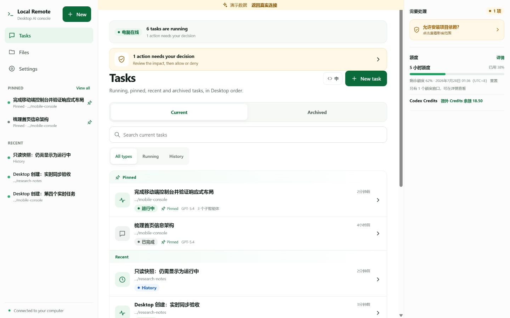
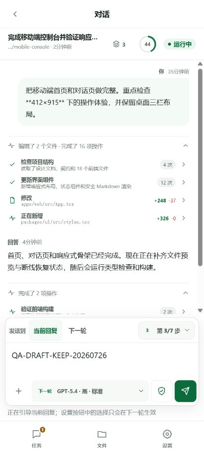
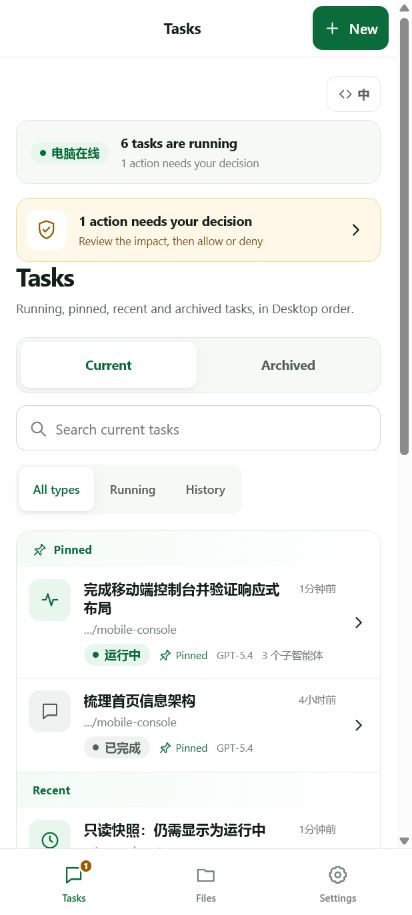

# ChatGPT / Codex Local Remote

> A secure, self-hosted remote control for your local ChatGPT / Codex Desktop tasks —
> from any modern phone browser, with no mobile app or traditional VPN required.
>
> 非官方、自托管的 ChatGPT / Codex Desktop 远程客户端：手机浏览器直接使用，
> 无需安装手机 App 或传统 VPN。

[](docs/windows-install.md)
[](docs/architecture.md)
[](LICENSE)

## Your Desktop tasks, in your pocket

- See the same live and historical tasks as ChatGPT / Codex Desktop.
- Start project or no-project tasks and choose the models your current Desktop exposes.
- Steer, queue or stop a running turn; answer approvals and structured questions remotely.
- Follow tool calls, file diffs, subagents, context usage and account limits in real time.
- Preview and download files only from explicitly registered projects.
- Use any modern Android or desktop browser. Installing a mobile app or traditional VPN is
  optional; bring your own HTTPS reverse proxy, or use Tailscale Funnel.
- Keep the native Desktop usable: the managed launcher fails open when Remote is unavailable.

<p align="center">
  
  
</p>

<details>
<summary>Mobile task list</summary>



</details>

> Screenshots use synthetic demo data. No host names, real conversations or private paths are
> included in the repository.

The interface defaults to Simplified Chinese and includes a persistent `EN / 中` switch for the
main product navigation. Task content and runtime-provided model or approval values are preserved
exactly as Desktop reports them.

### Fastest setup: give the repository to Codex

Clone this repository, open it in ChatGPT / Codex Desktop, and send:

> Read `AGENTS.md`, `README.md`, `docs/ai-maintenance.md`, and
> `docs/windows-install.md`. Install or upgrade ChatGPT / Codex Local Remote while preserving
> existing changes. Inspect the current Desktop runtime, ports, Broker/Sidecar, Tailscale and
> project registration before changing anything. Never use an independent CLI session to fake
> Desktop sync, never persist `CODEX_APP_SERVER_WS_URL`, and never print passwords or tokens.
> Run the repository checks, keep native Desktop fail-open, and stop only for an interactive
> password, an explicitly chosen project directory, the first Desktop handoff, public Funnel
> exposure, or a real Desktop restart.

See the [five-minute guide](docs/quickstart.md) or the full
[AI installation and maintenance contract](docs/ai-maintenance.md).

## 中文介绍

Codex Local Remote 由一个仅监听本机的 Sidecar 和一个移动优先的 PWA
组成。它通过 Codex 官方公开的 app-server 协议创建和托管对话，再由
Tailscale Serve/Funnel 或其他反向代理提供 HTTPS 入口。

本机 Broker 启动并独占一个 Codex app-server。Codex Desktop 与 Sidecar
分别通过回环 WebSocket 连接同一个 Broker，因此两端看到、订阅和操作的是
同一批实时任务，不再依赖两个进程之间的持久化快照。

app-server 的任务订阅按连接隔离。手机新建任务时，Broker 必要时以隐藏的
`thread/name/set` 让空任务壳持久化，再完成 Desktop 的 `thread/resume`
订阅屏障，最后才放行第一轮。Desktop 未连接时，手机新建任务会拒绝执行；
Sidecar 不在线时，Desktop 仍可通过 Broker 独立使用。

项目以中文体验为先，界面采用白底绿色视觉。它不是远程桌面，也不是把
JSON-RPC 日志原样铺进网页。

## 可以做什么

- 从手机选择已注册的桌面项目，或创建不关联任何项目的隔离对话；
- 查看全部已持久化历史，按 Desktop 的手工顺序只读镜像“置顶 / 最近”
  分组；首页合并 Desktop/Sidecar 的全部运行任务，不截断前三条；
- 在共享对话中实时查看当前回复、思考摘要、工具活动、文件变更、审批请求
  和结构化提问；只有运行时为本次请求明确提供的审批选项才会显示并可提交；
- 在运行中追加引导、停止任务，或把消息加入可编辑、排序和恢复的下一轮
  队列；
- 从运行时目录选择下一轮模型、思考等级、速度、权限、审批路由和计划模式，
  并可设置任务目标；
- 查看运行中或已完成的子智能体，进入详情后返回父对话；
- 查看 ChatGPT/Codex 额度窗口、重置时间、使用统计和线程上下文；
- 对话右上角用绿色上下文圆环显示当前任务已用上下文比例；点按后同时显示
  上下文 token、对话 ID、实际运行参数，以及与圆环明确分开的账号额度和
  UTC+8 重置时间；
- 显示 Codex 自动或手动触发的上下文压缩状态；空闲共享对话还可手动发起，
  并按真实事件区分“已受理”和“已完成”；
- 浏览、预览和下载已注册项目内的文件；
- 在手机和 Desktop 之间实时续接同一个任务，保持一致的任务与轮次标识；
- 使用一个本地设置的密码登录，手机无需安装应用、扩展或 Tailscale；
- 在断线或页面重载后恢复事件流、新建任务提示词、项目/非项目选择、现有
  对话草稿、滚动位置和子智能体导航状态；
- 长对话按最近内容渐进渲染，可逐段展开全部历史；输入框更新不会重新解析
  已经显示过的整段 Markdown；完整历史快照只作低频兜底，正在输入时会
  延后。
- 浏览器标签页会在断线、等待处理、运行和失败时给出简短状态提示，无需
  安装 PWA 或授权系统通知。

## 明确不能做什么

- 不能在同一轮生成中热切换模型或思考等级；
- 不能显示模型隐藏的完整思维链；
- 不能保证所有中国大陆网络都能稳定访问某一个公网入口；
- 无项目对话不授予文件浏览或下载能力；
- Web 只镜像 Desktop 的任务置顶状态，不直接修改 Desktop 私有置顶配置；
- app-server 不提供 Desktop 原生未发送队列接口；Web 队列只会在真正派发后
  出现在 Desktop，不伪装成已同步的 Desktop 草稿；
- app-server 若没有为某条审批请求提供可提交选项，Web 只能显示阻塞原因，
  不能猜造“允许一次 / 拒绝”等按钮；
- 不提供任意磁盘、任意命令或 app-server 原始接口的公网代理。

## 架构

```text
手机/电脑浏览器
      │ HTTPS + SSE
      ▼
Tailscale Serve / Funnel
      │
      ▼
本机 Sidecar ─────┐
      │            │
      ├─ 单密码登录、会话、限速、Origin/CSRF
      ├─ 项目白名单、文件只读网关
      ├─ 领域事件投影与重连
      └─ 最小化审计元数据
                   │ loopback WebSocket
Codex Desktop ─────┤
                   ▼
              本机 Broker ── 单一 Codex app-server
```

使用 Funnel 子路径时，配置 target 必须包含同一个 BasePath（默认是
`http://127.0.0.1:18790/codex-remote`）；Tailscale 会先剥离公网前缀，
这样 sidecar 最终仍能收到它所服务的前缀路径。

Broker 只使用当前 Codex Desktop 安装中动态发现的 `codex.exe`，不要求也
不会回退到用户另行安装的 Codex CLI。无法确认 Desktop 随附运行时时会明确
失败。Broker 与 app-server 的原始 WebSocket 都只绑定回环地址，公网浏览器
只能到达经过认证和授权的 Sidecar API。

计划任务不固定 Codex 版本号或 WindowsApps 路径。Sidecar 会持续核对受管
启动回执、请求级 `/ready` 和 Broker 的无敏感状态。包路径或二进制哈希
漂移时，已验证的旧运行链只要实时模型/任务能力探针仍通过就继续可用并提示
待切换；Desktop 断开、回执无法验证或协议探针失败时才暂停新执行，不显示
假在线。

Windows 兼容层通过 fail-open 启动器，在单次 Desktop 子进程范围内使用当前
隐藏的 `CODEX_APP_SERVER_WS_URL` override。项目不会把该值持久写入用户或
系统环境：只有精确受管的 Broker 与 app-server 已通过就绪检查时才注入；
Remote 未启动、端口不可达、身份不匹配或检查超时时，启动器会去掉 override
并照常打开原生 Desktop。冷启动最多等待 30 秒，让动态 Desktop 版本发现、
Broker 和 Sidecar 先完成传输握手，再启动并等待 Desktop 接入；在 Desktop
尚未接入时进程保持存活但执行 API 明确禁用，避免启动器与 Sidecar 互相等待。
最坏结果只能是“远程离线”。这个隐藏入口不是稳定的公开 Desktop 接口；升级
Codex Desktop 或随附 Codex 后，仍必须重新进行 Desktop、Sidecar、Broker
同实例的实机验收，不能只凭单元测试宣称兼容。

Remote 自身更新也遵循同一条桌面优先边界：新构建可以写入磁盘，Sidecar
可以在任务空闲时单独热更新；只要 Desktop 或任何远程任务仍依赖当前 Broker，
停止脚本就会拒绝终止它。Broker 代码与 Codex Desktop 新安装代只在自然的
受控重启窗口切换，不能为了“让更新立即生效”打断桌面登录或正在运行的任务。

## 当前状态

共享 Broker 是当前公开实现；Desktop 兼容性仍按每个 Desktop/Codex 版本
实机验收。未完成对应验收的版本只能视为“可用但有限制”。完整边界与验收
标准见：

- [产品设计](docs/product-design.md)
- [五分钟使用指南](docs/quickstart.md)
- [交给 AI 安装与维护](docs/ai-maintenance.md)
- [架构设计](docs/architecture.md)
- [威胁模型](docs/threat-model.md)
- [功能边界矩阵](docs/feature-matrix.md)
- [实施计划](docs/implementation-plan.md)
- [Windows 安装与 Funnel](docs/windows-install.md)

## 安全原则

这是一个能够触发本机 Codex 操作的公网入口。默认实现遵循以下原则：

- app-server 永远不直接监听公网；
- Broker WebSocket 永远只接受本机回环连接；
- 密码只以带随机盐的强哈希保存在本机运行目录；
- 浏览器使用 `Secure`、`HttpOnly`、`SameSite=Strict` 会话 Cookie；
- 登录失败会限速和临时锁定；
- 项目授权绑定注册时的 canonical path 与目录身份；根被移动、替换或改成
  junction 后，文件访问和新任务都会拒绝，直到电脑本机重新登记；
- 无项目对话使用独立的有界目录，但该目录不进入文件网关；
- Desktop 置顶适配器以 2 MiB 上限只读解析 `codexHome` 下的全局状态，
  只提取并返回最多 100 个 `pinned-thread-ids`，不写入该文件，也不记录或
  返回其他键；
- 已发送对话正文、文件内容和 Codex 登录凭据不复制到 Sidecar 数据库；
- 尚未派发的下一轮正文只以 Windows 当前用户 DPAPI 密文进入原子 outbox，
  不进入日志、SSE 或浏览器持久存储；
- Markdown、工具输出和文件名全部按不可信输入处理；
- 公开仓库只包含示例配置，不包含真实主机、密码或历史记录。

## 免责声明

本项目为社区非官方项目，与 OpenAI 或 Tailscale 无隶属、背书或合作关系。
Codex、OpenAI 和 Tailscale 是其各自权利人的商标。
